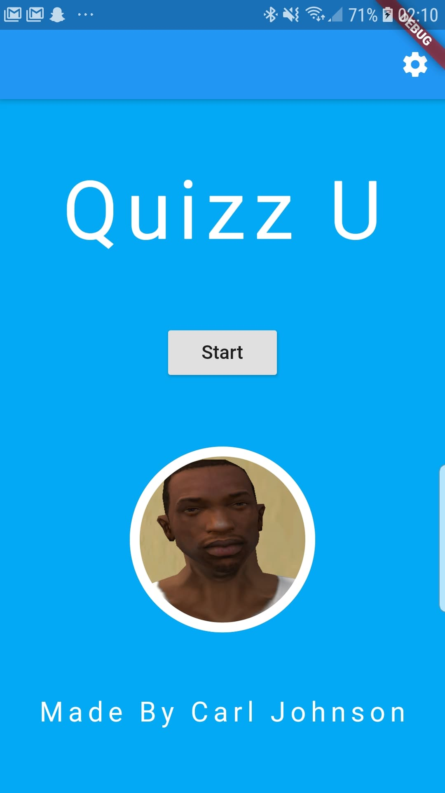
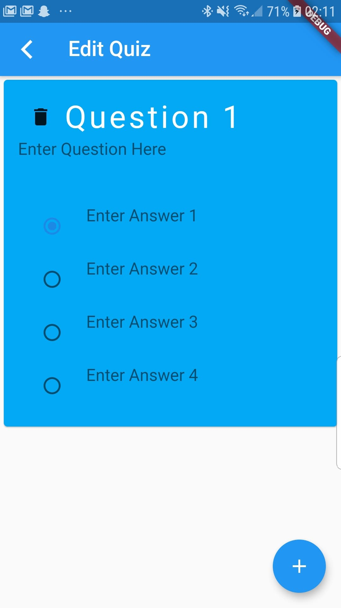
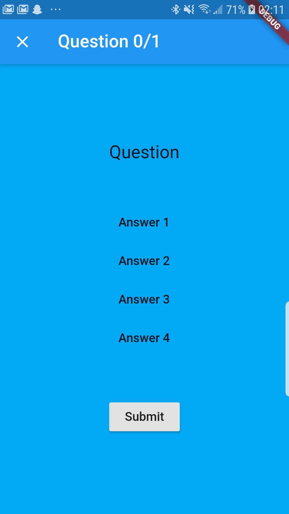
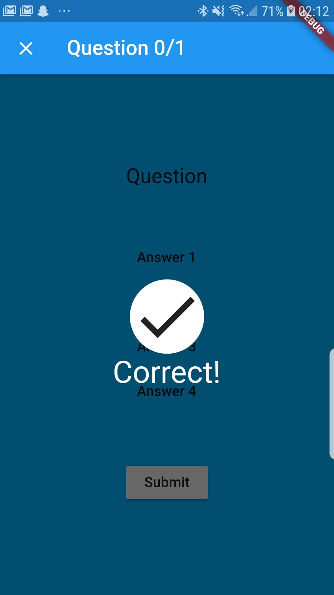

# tutorial

A Flutter project created initially for a hackathon workshop introducing programmers to mobile development. 

QuizU is a simple quiz application where users can input questions and answers to quiz their friends!

For reference here is the recommended starting point for beginners from Flutter: 

## Getting Started

This project is a starting point for a Flutter application.

A few resources to get you started if this is your first Flutter project:

- [Lab: Write your first Flutter app](https://flutter.dev/docs/get-started/codelab)
- [Cookbook: Useful Flutter samples](https://flutter.dev/docs/cookbook)

For help getting started with Flutter, view our
[online documentation](https://flutter.dev/docs), which offers tutorials,
samples, guidance on mobile development, and a full API reference.
